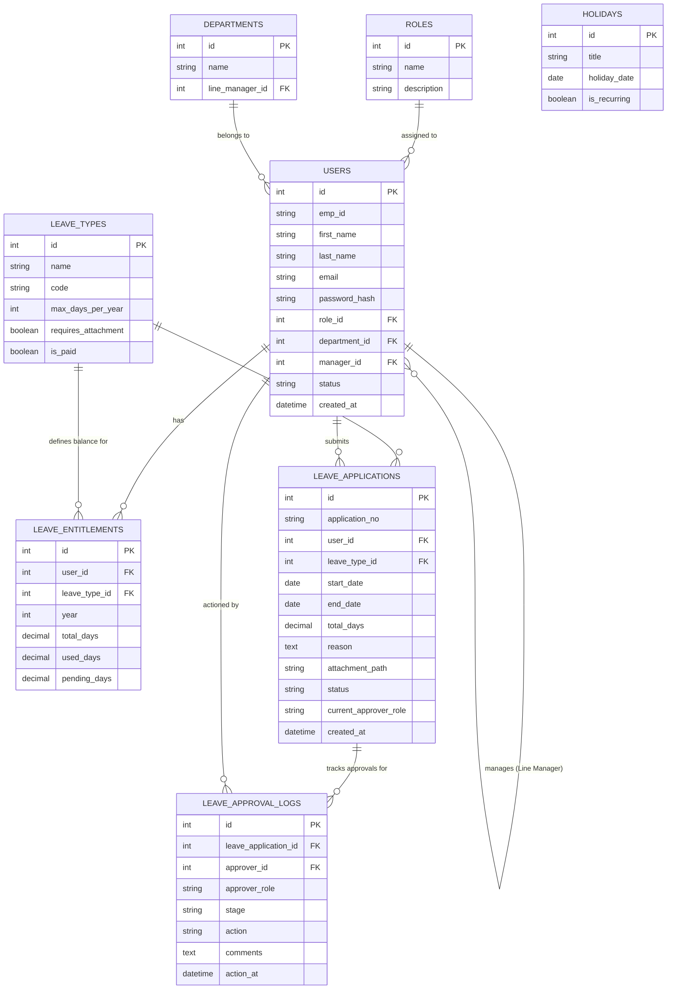

# Database Design & ERD Specification
## Leave Management System (LMS)

---

## 1. Entity-Relationship Diagram (ERD)



---

## 2. Data Dictionary

### 2.1 Table: `roles`
Stores user roles defining application access levels.
| Column | Type | Constraints | Description |
|---|---|---|---|
| `id` | INT | PK, AUTO_INCREMENT | Unique Role ID |
| `name` | VARCHAR(50) | UNIQUE, NOT NULL | Role name ('employee', 'manager', 'hr', 'executive', 'admin') |
| `description` | VARCHAR(255) | NULL | Role description |

### 2.2 Table: `departments`
Organizational departments.
| Column | Type | Constraints | Description |
|---|---|---|---|
| `id` | INT | PK, AUTO_INCREMENT | Unique Department ID |
| `name` | VARCHAR(100) | NOT NULL | Department name (e.g. IT, Finance, HR) |
| `line_manager_id` | INT | FK to `users(id)`, NULL | Designated default line manager |

### 2.3 Table: `users`
System user accounts.
| Column | Type | Constraints | Description |
|---|---|---|---|
| `id` | INT | PK, AUTO_INCREMENT | Unique User ID |
| `emp_id` | VARCHAR(20) | UNIQUE, NOT NULL | Employee ID string (e.g. EMP-001) |
| `first_name` | VARCHAR(50) | NOT NULL | User first name |
| `last_name` | VARCHAR(50) | NOT NULL | User last name |
| `email` | VARCHAR(100) | UNIQUE, NOT NULL | User email address (login credential) |
| `password_hash` | VARCHAR(255) | NOT NULL | BCRYPT hashed password |
| `role_id` | INT | FK to `roles(id)`, NOT NULL | Assigned user role |
| `department_id` | INT | FK to `departments(id)`, NULL | Assigned department |
| `manager_id` | INT | FK to `users(id)`, NULL | Direct Line Manager |
| `status` | ENUM | NOT NULL, DEFAULT 'active' | Account status ('active', 'inactive') |
| `created_at` | DATETIME | DEFAULT CURRENT_TIMESTAMP | Registration timestamp |

### 2.4 Table: `leave_types`
Available categories of leave.
| Column | Type | Constraints | Description |
|---|---|---|---|
| `id` | INT | PK, AUTO_INCREMENT | Unique Leave Type ID |
| `name` | VARCHAR(50) | NOT NULL | Leave name (Annual, Sick, Casual, etc.) |
| `code` | VARCHAR(10) | UNIQUE, NOT NULL | Short code (ANN, SCK, CSL, MAT) |
| `max_days_per_year` | INT | NOT NULL, DEFAULT 0 | Default annual day allocation |
| `requires_attachment` | TINYINT(1) | NOT NULL, DEFAULT 0 | 1 if medical certificate needed |
| `is_paid` | TINYINT(1) | NOT NULL, DEFAULT 1 | 1 if paid leave, 0 if unpaid |

### 2.5 Table: `leave_entitlements`
Yearly leave balance allocations per user per leave type.
| Column | Type | Constraints | Description |
|---|---|---|---|
| `id` | INT | PK, AUTO_INCREMENT | Unique Entitlement ID |
| `user_id` | INT | FK to `users(id)`, NOT NULL | Target User |
| `leave_type_id` | INT | FK to `leave_types(id)`, NOT NULL | Target Leave Type |
| `year` | INT | NOT NULL | Calendar year (e.g., 2026) |
| `total_days` | DECIMAL(5,2) | NOT NULL, DEFAULT 0.00 | Allocated days for the year |
| `used_days` | DECIMAL(5,2) | NOT NULL, DEFAULT 0.00 | Consumed days |
| `pending_days` | DECIMAL(5,2) | NOT NULL, DEFAULT 0.00 | Reserved days currently under approval |

### 2.6 Table: `holidays`
Official company and public holidays to exclude during days calculation.
| Column | Type | Constraints | Description |
|---|---|---|---|
| `id` | INT | PK, AUTO_INCREMENT | Unique Holiday ID |
| `title` | VARCHAR(100) | NOT NULL | Name of public holiday |
| `holiday_date` | DATE | NOT NULL, UNIQUE | Date of holiday |
| `is_recurring` | TINYINT(1) | DEFAULT 0 | 1 if annual recurring holiday |

### 2.7 Table: `leave_applications`
Leave request records.
| Column | Type | Constraints | Description |
|---|---|---|---|
| `id` | INT | PK, AUTO_INCREMENT | Unique Application ID |
| `application_no` | VARCHAR(30) | UNIQUE, NOT NULL | Formatted application number (LV-2026-0001) |
| `user_id` | INT | FK to `users(id)`, NOT NULL | Applicant user ID |
| `leave_type_id` | INT | FK to `leave_types(id)`, NOT NULL | Requested leave type |
| `start_date` | DATE | NOT NULL | Leave start date |
| `end_date` | DATE | NOT NULL | Leave end date |
| `total_days` | DECIMAL(5,2) | NOT NULL | Net working days requested |
| `reason` | TEXT | NOT NULL | Justification for leave |
| `attachment_path` | VARCHAR(255) | NULL | File path for medical notes |
| `status` | ENUM | NOT NULL | Status ('pending_manager', 'pending_hr', 'pending_executive', 'approved', 'rejected', 'cancelled') |
| `current_approver_role` | VARCHAR(50) | NOT NULL | Active stage role ('manager', 'hr', 'executive', 'none') |
| `created_at` | DATETIME | DEFAULT CURRENT_TIMESTAMP | Submission timestamp |

### 2.8 Table: `leave_approval_logs`
Audit log of every approval/rejection action.
| Column | Type | Constraints | Description |
|---|---|---|---|
| `id` | INT | PK, AUTO_INCREMENT | Unique Audit Log ID |
| `leave_application_id` | INT | FK to `leave_applications(id)` | Linked application |
| `approver_id` | INT | FK to `users(id)` | User who actioned |
| `approver_role` | VARCHAR(50) | NOT NULL | Role of approver at time of action |
| `stage` | VARCHAR(50) | NOT NULL | Workflow stage ('manager', 'hr', 'executive') |
| `action` | ENUM | NOT NULL | Action taken ('approved', 'rejected') |
| `comments` | TEXT | NULL | Approver comments or rejection reason |
| `action_at` | DATETIME | DEFAULT CURRENT_TIMESTAMP | Action timestamp |

---

## 3. SQL Schema Script (`schema.sql`)

```sql
CREATE DATABASE IF NOT EXISTS `lms_db` DEFAULT CHARACTER SET utf8mb4 COLLATE utf8mb4_unicode_ci;
USE `lms_db`;

-- Roles Table
CREATE TABLE IF NOT EXISTS `roles` (
    `id` INT AUTO_INCREMENT PRIMARY KEY,
    `name` VARCHAR(50) NOT NULL UNIQUE,
    `description` VARCHAR(255) NULL
) ENGINE=InnoDB DEFAULT CHARSET=utf8mb4;

-- Departments Table
CREATE TABLE IF NOT EXISTS `departments` (
    `id` INT AUTO_INCREMENT PRIMARY KEY,
    `name` VARCHAR(100) NOT NULL,
    `line_manager_id` INT NULL
) ENGINE=InnoDB DEFAULT CHARSET=utf8mb4;

-- Users Table
CREATE TABLE IF NOT EXISTS `users` (
    `id` INT AUTO_INCREMENT PRIMARY KEY,
    `emp_id` VARCHAR(20) NOT NULL UNIQUE,
    `first_name` VARCHAR(50) NOT NULL,
    `last_name` VARCHAR(50) NOT NULL,
    `email` VARCHAR(100) NOT NULL UNIQUE,
    `password_hash` VARCHAR(255) NOT NULL,
    `role_id` INT NOT NULL,
    `department_id` INT NULL,
    `manager_id` INT NULL,
    `status` ENUM('active', 'inactive') DEFAULT 'active',
    `created_at` DATETIME DEFAULT CURRENT_TIMESTAMP,
    CONSTRAINT `fk_users_role` FOREIGN KEY (`role_id`) REFERENCES `roles`(`id`),
    CONSTRAINT `fk_users_department` FOREIGN KEY (`department_id`) REFERENCES `departments`(`id`) ON DELETE SET NULL,
    CONSTRAINT `fk_users_manager` FOREIGN KEY (`manager_id`) REFERENCES `users`(`id`) ON DELETE SET NULL
) ENGINE=InnoDB DEFAULT CHARSET=utf8mb4;

ALTER TABLE `departments` 
ADD CONSTRAINT `fk_departments_manager` FOREIGN KEY (`line_manager_id`) REFERENCES `users`(`id`) ON DELETE SET NULL;

-- Leave Types Table
CREATE TABLE IF NOT EXISTS `leave_types` (
    `id` INT AUTO_INCREMENT PRIMARY KEY,
    `name` VARCHAR(50) NOT NULL,
    `code` VARCHAR(10) NOT NULL UNIQUE,
    `max_days_per_year` INT NOT NULL DEFAULT 0,
    `requires_attachment` TINYINT(1) NOT NULL DEFAULT 0,
    `is_paid` TINYINT(1) NOT NULL DEFAULT 1
) ENGINE=InnoDB DEFAULT CHARSET=utf8mb4;

-- Leave Entitlements Table
CREATE TABLE IF NOT EXISTS `leave_entitlements` (
    `id` INT AUTO_INCREMENT PRIMARY KEY,
    `user_id` INT NOT NULL,
    `leave_type_id` INT NOT NULL,
    `year` INT NOT NULL,
    `total_days` DECIMAL(5,2) NOT NULL DEFAULT 0.00,
    `used_days` DECIMAL(5,2) NOT NULL DEFAULT 0.00,
    `pending_days` DECIMAL(5,2) NOT NULL DEFAULT 0.00,
    CONSTRAINT `fk_entitlements_user` FOREIGN KEY (`user_id`) REFERENCES `users`(`id`) ON DELETE CASCADE,
    CONSTRAINT `fk_entitlements_type` FOREIGN KEY (`leave_type_id`) REFERENCES `leave_types`(`id`) ON DELETE CASCADE,
    UNIQUE KEY `unique_user_type_year` (`user_id`, `leave_type_id`, `year`)
) ENGINE=InnoDB DEFAULT CHARSET=utf8mb4;

-- Holidays Table
CREATE TABLE IF NOT EXISTS `holidays` (
    `id` INT AUTO_INCREMENT PRIMARY KEY,
    `title` VARCHAR(100) NOT NULL,
    `holiday_date` DATE NOT NULL UNIQUE,
    `is_recurring` TINYINT(1) DEFAULT 0
) ENGINE=InnoDB DEFAULT CHARSET=utf8mb4;

-- Leave Applications Table
CREATE TABLE IF NOT EXISTS `leave_applications` (
    `id` INT AUTO_INCREMENT PRIMARY KEY,
    `application_no` VARCHAR(30) NOT NULL UNIQUE,
    `user_id` INT NOT NULL,
    `leave_type_id` INT NOT NULL,
    `start_date` DATE NOT NULL,
    `end_date` DATE NOT NULL,
    `total_days` DECIMAL(5,2) NOT NULL,
    `reason` TEXT NOT NULL,
    `attachment_path` VARCHAR(255) NULL,
    `status` ENUM('pending_manager', 'pending_hr', 'pending_executive', 'approved', 'rejected', 'cancelled') NOT NULL DEFAULT 'pending_manager',
    `current_approver_role` VARCHAR(50) NOT NULL DEFAULT 'manager',
    `created_at` DATETIME DEFAULT CURRENT_TIMESTAMP,
    CONSTRAINT `fk_applications_user` FOREIGN KEY (`user_id`) REFERENCES `users`(`id`) ON DELETE CASCADE,
    CONSTRAINT `fk_applications_type` FOREIGN KEY (`leave_type_id`) REFERENCES `leave_types`(`id`) ON DELETE CASCADE,
    INDEX `idx_app_user_status` (`user_id`, `status`),
    INDEX `idx_app_dates` (`start_date`, `end_date`)
) ENGINE=InnoDB DEFAULT CHARSET=utf8mb4;

-- Leave Approval Logs Table
CREATE TABLE IF NOT EXISTS `leave_approval_logs` (
    `id` INT AUTO_INCREMENT PRIMARY KEY,
    `leave_application_id` INT NOT NULL,
    `approver_id` INT NOT NULL,
    `approver_role` VARCHAR(50) NOT NULL,
    `stage` VARCHAR(50) NOT NULL,
    `action` ENUM('approved', 'rejected') NOT NULL,
    `comments` TEXT NULL,
    `action_at` DATETIME DEFAULT CURRENT_TIMESTAMP,
    CONSTRAINT `fk_logs_application` FOREIGN KEY (`leave_application_id`) REFERENCES `leave_applications`(`id`) ON DELETE CASCADE,
    CONSTRAINT `fk_logs_approver` FOREIGN KEY (`approver_id`) REFERENCES `users`(`id`) ON DELETE CASCADE
) ENGINE=InnoDB DEFAULT CHARSET=utf8mb4;
```
