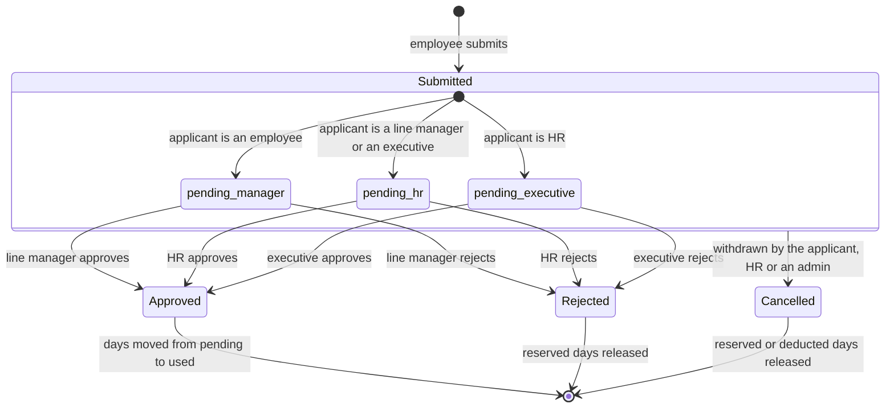

# Approval Workflow & State Machine Specification
## Leave Management System (LMS)

---

## 1. One approval decides a request

A leave request is decided by a single approver, and that decision is final.
There is no second stage and no escalation: the approval that arrives is the one
that books the leave and deducts the days.

Who that approver is depends on the applicant's own role, because nobody signs
off on their own leave:



| Applicant | Enters at | Decided by | Stages after |
|---|---|---|---|
| Employee | `pending_manager` | Their line manager, or the head of their department | none |
| Line Manager | `pending_hr` | HR | none |
| Executive | `pending_hr` | HR | none |
| HR | `pending_executive` | The executive | none |
| System Admin | — | Cannot apply: holds no leave entitlement | — |

The three statuses are therefore **three queues holding three kinds of
applicant**, not three stages of one request. All three screens remain, named
for whose leave each one holds.

An administrator may act on any of the three as a break-glass override when the
designated approver is unavailable. The screens warn when an admin is the one
acting, and the audit log records it against their account.

---

## 2. State transition matrix

| Initial status | Trigger | Required role | Next status | Effect on the entitlement |
|---|---|---|---|---|
| — | `submit()` | Any staff role | `pending_manager`, `pending_hr` or `pending_executive` by applicant role | Requested days added to `pending_days`. Available balance falls |
| `pending_manager` | `approve()` | Line Manager / Admin | `approved` | `pending_days` reduced, `used_days` increased. Log written |
| `pending_hr` | `approve()` | HR / Admin | `approved` | `pending_days` reduced, `used_days` increased. Log written |
| `pending_executive` | `approve()` | Executive / Admin | `approved` | `pending_days` reduced, `used_days` increased. Log written |
| any pending | `reject()` | The role that decides it, or Admin | `rejected` | `pending_days` released. Available balance restored. Log written |
| any pending | `cancel()` | Applicant, HR or Admin | `cancelled` | `pending_days` released |
| `approved` | `cancel()` | Applicant before it starts; HR or Admin at any time | `cancelled` | `used_days` restored |
| `approved` | `approve()` | — | refused | Nothing. `nextStageFor()` throws, which is what stops a second approval deducting twice |

The entitlement row touched is not always the one named on the request: a
category may spend another category's balance. See section 5.

---

## 3. Who may act on each queue

Enforced in `ApprovalWorkflow::processAction()`, in this order: the application
is locked `FOR UPDATE`, self-approval is refused outright, then the acting role
is checked against the status.

### `pending_manager` — an employee's own leave
- **Line Manager**, but only for their own people: the applicant's `manager_id`
  must be them, or they must be the `line_manager_id` of the applicant's
  department. A manager elsewhere in the organisation is refused.
- **Admin**, as break-glass.

### `pending_hr` — a line manager's or an executive's own leave
- **HR**, any active holder of the role.
- **Admin**, as break-glass.

### `pending_executive` — HR's own leave
- **Executive**, any active holder of the role.
- **Admin**, as break-glass.

> **Self-approval is refused before the role is even considered.** An HR manager
> cannot approve their own request by virtue of being HR, which is exactly why
> their leave routes to the executive instead.

---

## 4. What the approver is told

The change that matters most to an approver is not on the queue screen but in
what it now means to press Approve. Under the old chain a line manager was one
signature of three, with HR and an executive behind them. They are now the whole
decision.

So the review modal carries the sentence "Your decision is final. Approving
books the leave and deducts the days; nobody reviews it after you", the button
reads **Approve & Book Leave**, and the notification and email carry the same
line - in the email as its own labelled row, because the prose body is not
rendered once there is a detail table.

---

## 5. Balance sourcing

A leave category may hold no allowance of its own and spend another's, which is
how Emergency Leave works: the days come off Annual Leave.

`leave_types.deducts_from_type_id` names the category whose
`leave_entitlements` row is reserved against, deducted from, released and
restored. It is resolved in one hop by `LeaveCalculator::balanceTypeFor()`, and
every balance operation in the workflow follows it. The application row still
records the category that was asked for, so an emergency is emergency leave in
every report while the days come from where they actually came from.

`leave_types.allow_negative_balance` lets such a request pass a balance it
exceeds. Emergency leave may: the absence has already happened by the time
anybody records it, so refusing it would not protect the balance, it would leave
the register denying an absence that took place. A **missing allocation row** is
still refused, because there would be no row to deduct from at all.

---

## 6. Progress display

A request has two steps, and the detail screen draws exactly those:

```
[ Submitted 14 Oct ] ────► [ Approved - the days have been deducted ]
                           [ Declined - the days were returned      ]
                           [ With your line manager, awaiting a decision ]
```

The audit trail beneath it lists every action with the approver, their role, the
status the request was in when they acted, and their remarks. Rows written
before this change carry the same values and read correctly: the stage column is
simply who decided it.
