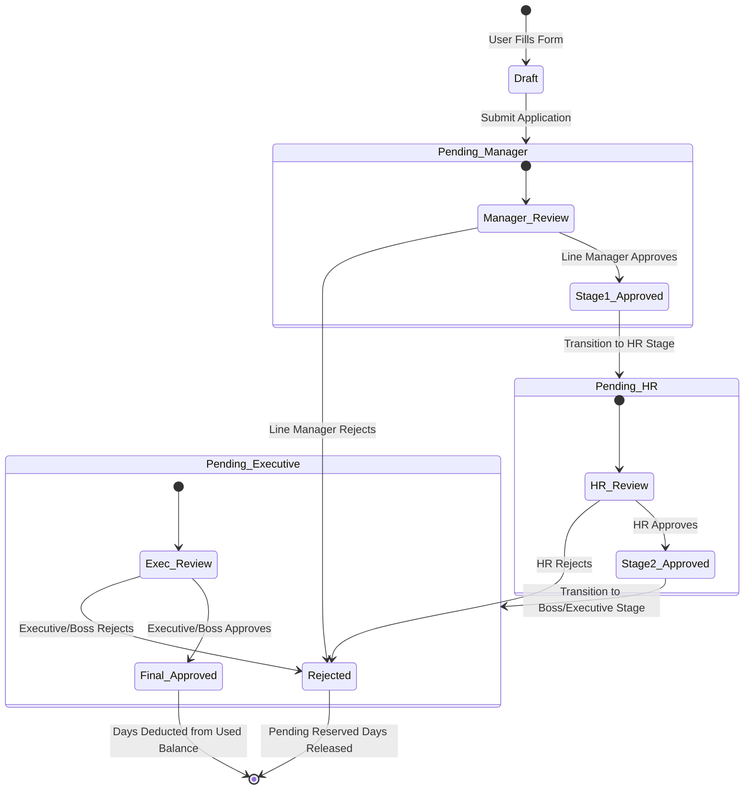

# Approval Workflow & State Machine Specification
## Leave Management System (LMS)

---

## 1. 3-Stage Sequential Approval Flow

The application follows a strict 3-tier approval hierarchy before a leave application reaches final authorization:



---

## 2. State Transition Matrix

| Initial Status | Trigger Action | Required Role | Next Status | Side Effects on Entitlement Balance |
|---|---|---|---|---|
| **Draft** | `submit()` | Employee | `pending_manager` | Total requested days added to `pending_days`. Available balance reduced. |
| `pending_manager` | `approve()` | Line Manager / Admin | `pending_hr` | `current_approver_role` updated to `'hr'`. `pending_days` maintained. Log written to `leave_approval_logs`. |
| `pending_manager` | `reject()` | Line Manager / Admin | `rejected` | Workflow terminates. `pending_days` reduced by requested amount. Available balance restored. |
| `pending_hr` | `approve()` | HR / Admin | `pending_executive` | `current_approver_role` updated to `'executive'`. Log written to `leave_approval_logs`. |
| `pending_hr` | `reject()` | HR / Admin | `rejected` | Workflow terminates. `pending_days` released back to available. Log written. |
| `pending_executive` | `approve()` | Executive / Admin | `approved` | Application marked `approved`. `pending_days` subtracted, `used_days` increased by requested amount. |
| `pending_executive` | `reject()` | Executive / Admin | `rejected` | Workflow terminates. `pending_days` released back to available. Log written. |
| `pending_*` | `cancel()` | Employee (Owner) | `cancelled` | Allowed only before Stage 1 review. `pending_days` released back to available balance. |

---

## 3. Detailed Stage Specifications

### Stage 1: Line Manager Review (`pending_manager`)
- **Assigned Approver**: Direct `manager_id` assigned to the applicant's user record (or System Admin).
- **Authorized Actions**: `Approve`, `Reject`.
- **Validation**: Cannot review own leave application.

### Stage 2: HR Review (`pending_HR`)
- **Assigned Approver**: Any user with `role_id` = **HR Manager** (or System Admin).
- **Authorized Actions**: `Approve`, `Reject`.
- **Validation**: Verifies compliance with corporate policy, medical certificate validity, and statutory limits.

### Stage 3: Executive / Boss Review (`pending_executive`)
- **Assigned Approver**: Any user with `role_id` = **Executive / Boss** (or System Admin).
- **Authorized Actions**: `Approve`, `Reject`.
- **Validation**: Final operational sign-off.

---

## 4. UI Approval Progress Tracker Component

When viewing a leave application detail page, the system renders a visual timeline tracker:

```
[ Stage 1: Manager ] ====> [ Stage 2: HR ] ====> [ Stage 3: Boss ] ====> [ Status: APPROVED ]
   (Completed)                 (Completed)           (Active)                 (Pending)
```

### Component Status Classes:
- **Completed**: Green checkmark icon with approver name & date.
- **Active**: Pulsing blue highlight indicating active queue.
- **Pending**: Muted gray step.
- **Rejected**: Solid red cross badge with rejection comments modal link.
