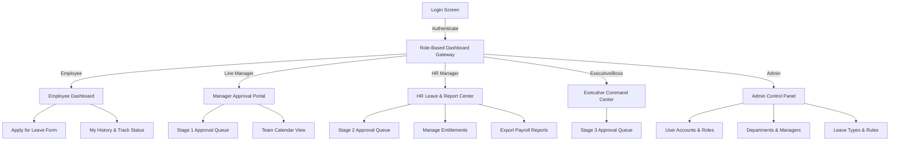

# UI/UX Wireframes & Component Map
## Leave Management System (LMS)

---

## 1. User Interface Navigation Flow



---

## 2. Layout Component Mapping

Every module view renders inside the standard Bootstrap 5 container framework:

```
+-------------------------------------------------------------------+
|                        NAVBAR (includes/navbar.php)                |
|  [Logo] LMS      [Search...]               [Avatar] Jane (Manager)|
+-------------------+-----------------------------------------------+
| SIDEBAR           | BREADCRUMB / PAGE TITLE                       |
| (includes/        +-----------------------------------------------+
|  sidebar.php)     |                                               |
|                   | MAIN CONTENT AREA                             |
|  - Dashboard      | (Rendered dynamically by module view)         |
|  - Apply Leave    |                                               |
|  - Team Queue (3) |  +--------------------+ +-------------------+ |
|  - Reports        |  | Stats Card 1       | | Stats Card 2      | |
|  - Settings       |  +--------------------+ +-------------------+ |
|                   |                                               |
|                   |  +-----------------------------------------+  |
|                   |  | Data Table / Form Container             |  |
|                   |  +-----------------------------------------+  |
|                   |                                               |
+-------------------+-----------------------------------------------+
|                        FOOTER (includes/footer.php)                |
|  © 2026 LMS Inc. All rights reserved.                             |
+-------------------------------------------------------------------+
```

---

## 3. Screen Wireframes

### 3.1 Employee Leave Application Form (`modules/leave/apply.php`)

```
+-------------------------------------------------------------------+
| Apply for Leave                                                   |
+-------------------------------------------------------------------+
| Leave Type:      [ Select Leave Type (e.g. Annual Leave)      v ] |
|                                                                   |
| Start Date:      [ 2026-08-01 ]   End Date: [ 2026-08-10 ]        |
|                                                                   |
| [!] Calculated Duration: 6 Working Days (Excludes 2 Weekends)     |
| [i] Available Balance: 15.0 Days                                  |
|                                                                   |
| Reason:          [ Family vacation commitment...                ] |
|                                                                   |
| Attachment:      [ Choose File ] (Medical Note required for Sick) |
|                                                                   |
|                  [ Cancel ]               [ Submit Application ]  |
+-------------------------------------------------------------------+
```

### 3.2 Approval Portal Modal (`modules/manager/approvals.php`)

```
+-------------------------------------------------------------------+
| Review Leave Application: LV-2026-0089                            |
+-------------------------------------------------------------------+
| Applicant: John Doe (IT Dept)     Type: Annual Leave              |
| Dates: Aug 01, 2026 - Aug 10, 2026 (6 Working Days)               |
| Reason: Family vacation commitment                                |
|                                                                   |
| Progress:                                                         |
| [x] Manager Review  -->  [ ] HR Review  -->  [ ] Executive        |
|                                                                   |
| Approver Comments:                                                |
| [ Approved. Handover plan confirmed with team lead.             ] |
|                                                                   |
| [ Close ]           [ Reject Request (Red) ]   [ Approve (Green) ]|
+-------------------------------------------------------------------+
```

---

## 4. UI Color Palette & Bootstrap Design Token Specifications

| Element | Bootstrap Class / CSS Var | Hex Code | Purpose |
|---|---|---|---|
| Primary Theme | `btn-primary`, `--bs-primary` | `#3B82F6` | Primary action buttons, active navigation |
| Secondary | `btn-secondary` | `#64748B` | Cancel actions, muted text |
| Success (Approved)| `badge bg-success`, `.text-success` | `#10B981` | Final approved status, available balance |
| Warning (Pending)| `badge bg-warning`, `.text-warning` | `#F59E0B` | Pending approvals |
| Danger (Rejected)| `badge bg-danger`, `.text-danger` | `#EF4444` | Rejected status, errors |
| Info (Processing)| `badge bg-info`, `.text-info` | `#06B6D4` | Stage transition highlights |
| Dark Background | `.bg-dark`, `data-bs-theme="dark"` | `#0F172A` | Sidebar & navbar background |
