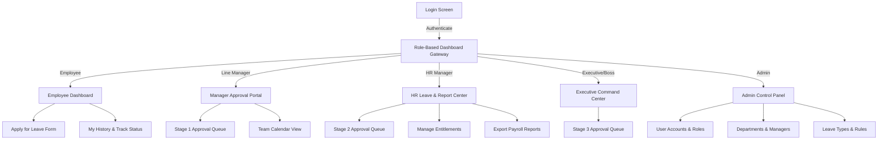

# UI/UX Wireframes & Component Map
## Leave Management System (LMS)

---

## 1. User Interface Navigation Flow


```mermaid
graph TD
    Login[Login Screen] -->|Authenticate| Dashboard[Role-Based Dashboard Gateway]
    
    Dashboard -->|Employee| EmpDash[Employee Dashboard]
    Dashboard -->|Line Manager| MgrDash[Manager Approval Portal]
    Dashboard -->|HR Manager| HRDash[HR Leave & Report Center]
    Dashboard -->|Executive/Boss| ExecDash[Executive Command Center]
    Dashboard -->|Admin| AdminDash[Admin Control Panel]

    EmpDash --> ApplyLeave[Apply for Leave Form]
    EmpDash --> MyHistory[My History & Track Status]

    MgrDash --> TeamQueue[Stage 1 Approval Queue]
    MgrDash --> TeamCal[Team Calendar View]

    HRDash --> Stage2Queue[Stage 2 Approval Queue]
    HRDash --> Allocations[Manage Entitlements]
    HRDash --> Reports[Export Payroll Reports]

    ExecDash --> Stage3Queue[Stage 3 Approval Queue]

    AdminDash --> ManageUsers[User Accounts & Roles]
    AdminDash --> ManageDepts[Departments & Managers]
    AdminDash --> ManageTypes[Leave Types & Rules]
```

---

## 2. Layout Component Mapping

Every module view renders inside the standard Bootstrap 4.4.1 container framework:

```
+-------------------------------------------------------------------+
|                        NAVBAR (includes/navbar.php)                |
|  [Logo] LMS      [Search...]               [Avatar] Jane (Manager)|
+-------------------+-----------------------------------------------+
| SIDEBAR           | BREADCRUMB / PAGE TITLE                       |
| (includes/        +-----------------------------------------------+
|  sidebar.php)     |                                               |
|                   | MAIN CONTENT AREA                             |
|  - Dashboard      | (Rendered dynamically by module view)         |
|  - Apply Leave    |                                               |
|  - Team Queue (3) |  +--------------------+ +-------------------+ |
|  - Reports        |  | Stats Card 1       | | Stats Card 2      | |
|  - Settings       |  +--------------------+ +-------------------+ |
|                   |                                               |
|                   |  +-----------------------------------------+  |
|                   |  | Data Table / Form Container             |  |
|                   |  +-----------------------------------------+  |
|                   |                                               |
+-------------------+-----------------------------------------------+
|                        FOOTER (includes/footer.php)                |
|  © 2026 LMS Inc. All rights reserved.                             |
+-------------------------------------------------------------------+
```

---

## 3. Screen Wireframes

### 3.1 Employee Leave Application Form (`modules/leave/apply.php`)

```
+-------------------------------------------------------------------+
| Apply for Leave                                    Leave Year 2026|
+-------------------------------------------------------------------+
| (i) One approval decides this. Your line manager decides ...      |
|                                                                   |
| Leave Category:  [ Annual Leave (16 days available)           v ] |
|   (i) 7 day(s) advance notice . min 0.5 day(s) . half-days allowed|
|                                                                   |
| Start Date: [ 21 Dec 2026  [#] ]  End Date: [ 31 Dec 2026  [#] ]  |
|             Duration: [ Full Day(s) v ]                           |
|  +-------------------------------------------------------------+  |
|  | <    December 2026               January 2027           >   |  |
|  | Mo Tu We Th Fr Sa Su        Mo Tu We Th Fr Sa Su            |  |
|  | 14 15 16 17 18 19 20        ...                              |  |
|  |[21]22 23 24 25.26 27        (25, 26: holidays, dotted)       |  |
|  | 28 29 30[31]       +-------------------------+               |  |
|  |                    | 8 working days . 11 days|  <- on hover  |  |
|  +-------------------------------------------------------------+  |
|                                                                   |
| Real-Time Request Summary                                     [8] |
|   Net Working Days: 8. Available Balance: 16 Days.                |
|   (Excludes 2 Public Holiday(s))                                  |
|                                                                   |
| Reason:          [ Anything your approver should know...        ] |
| Attachment:      [ Choose File ]                                  |
|                                                                   |
|                  [ Cancel ]               [ Submit Application ]  |
+-------------------------------------------------------------------+
```

**Leave Category.** Each option carries the applicant's own remaining balance,
`(16 days available)`, or `(no allowance)`; Emergency Leave reads
`(from Annual Leave, 16 days available)`.

**Date range calendar** (Litepicker, `assets/js/leave-range-picker.js`):

| Element | Behaviour |
|---|---|
| Display inputs | Read-only, show `D MMM YYYY`, open the calendar. The submitted values are hidden `start_date` / `end_date` fields in `YYYY-MM-DD` |
| Months | Two side by side from 768px, one below |
| Start / end day | Teal fill (`--ri-teal`), white bold text, rounded outer corners |
| Days in range | `--ri-info-bg` fill |
| Weekend | `--ri-muted-soft` text, locked as a first or last day |
| Public holiday | `--ri-blue` bold text with a dot beneath, name in the title tooltip, locked as a first or last day |
| Before the notice period | Locked |
| Tooltip | Navy (`--ri-navy`), "N working days" plus calendar days when they differ |
| Submit without dates | Fields marked invalid, calendar opens |

**Phone layout.** Below the `sm` breakpoint the action buttons stack, Submit
first and full width, Cancel beneath it.

### 3.2 Approval Portal Modal (`modules/manager/approvals.php`)

```
+-------------------------------------------------------------------+
| Review Leave Application: LV-2026-0089                            |
+-------------------------------------------------------------------+
| Applicant: John Doe (IT Dept)     Type: Annual Leave              |
| Dates: Aug 01, 2026 - Aug 10, 2026 (6 Working Days)               |
| Reason: Family vacation commitment                                |
|                                                                   |
| Progress:                                                         |
| [x] Manager Review  -->  [ ] HR Review  -->  [ ] Executive        |
|                                                                   |
| Approver Comments:                                                |
| [ Approved. Handover plan confirmed with team lead.             ] |
|                                                                   |
| [ Close ]           [ Reject Request (Red) ]   [ Approve (Green) ]|
+-------------------------------------------------------------------+
```

---

## 4. UI Color Palette & Design Tokens

The shipped palette is the Real Image theme in `assets/css/ri-theme.css`, declared
as CSS variables on `:root` and applied over Bootstrap 4.4.1. The table below is
read from that file; the pre-implementation Bootstrap 5 palette it replaced was
never used.

| Token | Hex | Used for |
|---|---|---|
| `--ri-navy` | `#0a1035` | Headings, page head band, date picker tooltip |
| `--ri-navy-deep` | `#040f31` | Utility bar, footer, sign-in gradient |
| `--ri-teal` | `#004668` | Primary buttons, chosen start and end day on the date picker |
| `--ri-blue` / `--ri-blue-light` | `#005394` / `#1173c4` | Links, focus rings, info, public holidays on the date picker |
| `--ri-info-bg` | `#e6eff7` | Info alerts, the days inside a chosen date range |
| `--ri-success` / `-bg` | `#17864a` / `#e7f5ec` | Approved status, available balance |
| `--ri-warning` / `-bg` | `#9a6200` / `#fdf3e0` | Pending, cover at its limit |
| `--ri-danger` / `-bg` | `#b3261e` / `#fdecea` | Rejected, errors, cover exceeded |
| `--ri-muted` / `--ri-muted-soft` | `#6b7280` / `#a3a4a8` | Secondary text, weekends on the date picker |
| `--ri-grey-line` / `--ri-page` | `#e2e6ee` / `#f6f7fa` | Borders, page background |
| `--ri-radius` / `--ri-pill` | `14px` / `50px` | Card and button rounding |
| `--ri-font` | Montserrat | All text |
